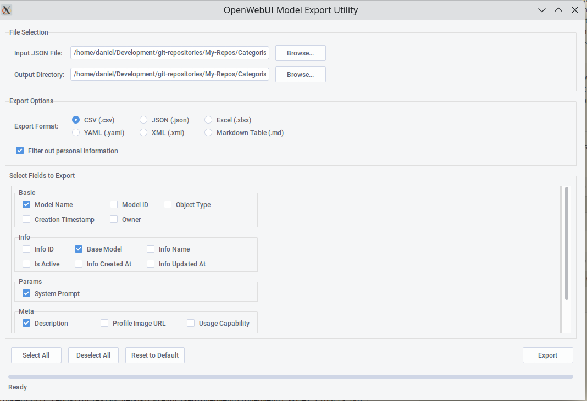

# OpenWebUI Model Export Converter

A collection of Python scripts and a GUI utility for processing and streamlining model exports from OpenWebUI. These tools help to create more condensed backups of model collections and improve portability by removing OpenWebUI-specific elements.



## Created: March 19, 2025

**Note:** Accuracy after this date cannot be guaranteed as OpenWebUI might change its data format. As of the creation date, these tools have been validated with the current OpenWebUI export format.

## Purpose

The primary purpose of these tools is to 
1. Streamline backing up model collections in a more condensed fashion
2. Remove OpenWebUI-specific elements that might not be required when importing elsewhere
3. Improve the portability of models across different platforms

## SQL

Individual model configurations are stored as rows in the `model` table in the OpenWebUI database.

An SQL query to retrieve the name, system prompt and descriptions:

`mysql
SELECT 
    name,
    (meta::json)->>'description' as description,
    (params::json)->>'system' as system_prompt
FROM model
ORDER BY name;
```

## Features

### GUI Utility

The GUI utility provides an interactive interface that allows you to:
- Select between different conversion variants
- Choose your preferred output format (CSV or simplified JSON)
- Easily select input and output files
- Configure conversion options

This is the recommended way to use the converter for most users.

### Command-Line Scripts

For automated and non-interactive conversion processes, simpler CLI scripts are also available:

#### 1. JSON to CSV Converter (`scripts/json_to_csv.py`)

This script creates a streamlined CSV export from the JSON data, capturing the essential information:
- Model name
- Description
- System prompt

The CSV format is more compact and easier to review than the original JSON structure.

#### 2. JSON Simplifier (`scripts/simplify_json.py`)

This script converts the original JSON format into a more streamlined version, keeping only the essential information:
- Model name
- System prompt
- Description

It also includes an option to filter out entries containing personal information.

## How to Use

### Using the GUI

1. Launch the GUI utility
2. Select your input JSON file exported from OpenWebUI
3. Choose your desired output format (CSV or simplified JSON)
4. Configure any additional options
5. Click the "Convert" button
6. Save the output file to your desired location

### Using the Command-Line Scripts

For automated or batch processing:

1. Place your OpenWebUI model export JSON file in the `input` directory as `input.json`
2. Run either script from the command line:

```bash
# For CSV conversion
python scripts/json_to_csv.py

# For JSON simplification
python scripts/simplify_json.py
```

3. Find the output files in the `output` directory with timestamps in their filenames

## Building Standalone Executable

A PyInstaller build script is included to create standalone executables for easy distribution. This allows users to run the application without installing Python or any dependencies.

### Prerequisites

- PyInstaller (`pip install pyinstaller`)

### Building the Executable

```bash
# Install PyInstaller if you haven't already
pip install pyinstaller

# Run the build script
python build.py
```

The executable will be created in the `dist` directory. On Windows, you'll find `OpenWebUI-Model-Converter.exe`, while on macOS and Linux, you'll find `OpenWebUI-Model-Converter`.

### Pre-built Binaries

Pre-built binaries for Windows, macOS, and Linux are available in the Releases section of this repository.

## Directory Structure

```
.
├── build.py           # PyInstaller build script
├── gui/               # GUI application
│   └── program.py     # Main GUI program
├── input/             # Place your input JSON files here
├── output/            # Processed files will be saved here
├── sample-data/       # Sample input data for reference
├── screenshots/       # Screenshots for documentation
│   └── gui/           # GUI screenshots
├── scripts/           # The processing scripts
│   ├── json_to_csv.py
│   └── simplify_json.py
└── requirements.txt   # Project dependencies
```

## Dependencies

The scripts use only standard Python libraries:
- json
- csv
- os
- sys
- datetime
- argparse (for simplify_json.py)

GUI dependencies:
- tkinter (included with most Python installations)

Build dependencies:
- PyInstaller (for creating standalone executables)

Optional enhancements:
- pandas (for more advanced data manipulation)
- tqdm (for progress bars when processing large files)

## Sample Data

The repository includes sample data in `sample-data/sample-input.json` to demonstrate the expected input format.

## Disclaimer

These tools are designed to work with the OpenWebUI export format as of March 19, 2025. Future updates to OpenWebUI may change the data format, which could affect the functionality of these tools.
